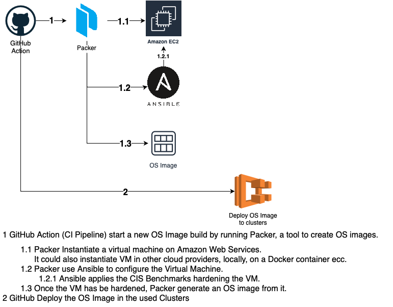
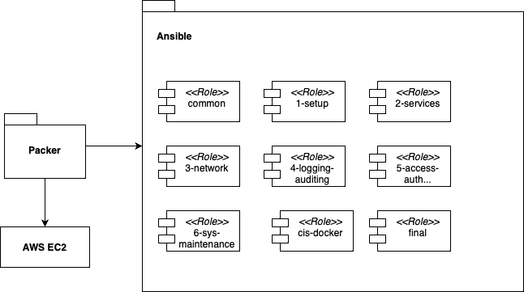

# ansible-cis-amazon-linux-2

### Overview


### Architecture


## Requirements 
```
ansible-galaxy collection install ansible.posix
ansible-galaxy collection install community.general
pip3 install ansible-lint
```

`yp` is also required for using the password update tool.

## Conventions

- Canonical module names are also known as resolved module names and they are to be preferred for most cases, do `ansible.builtin.yum` instead of `yum`.
- Prefer `ansible.builtin.command` to `ansible.builtin.shell` when possible (e.g. when not using pipes or redirections).

## build new AMI
### Arguments
`type`  can be set to:
  - base:        Install only CIS AL2 and Custom
  - docker:      Install base, CIS Docker, ECS agent
Default value is `base`

```
make deploy type=ecs
```

### Using AWS SSO login
Login with AWS SSO and build new ami.
> **Warning**
> This will use your default profile, in order to use a specific profile: `export AWS_PROFILE=dev`
`make sso ami type=docker`

## Test
### Arguments
`type`  can be set to:
  - base:        Install only CIS AL2 and Custom
  - docker:      Install base, CIS Docker, ECS agent
Default value is `base`

`make test type=docker` will start a Docker container and test the ansible playbook.

## Server password hash generation

`make pass_update` to update users password, change the value into `defaults/users.yml`
